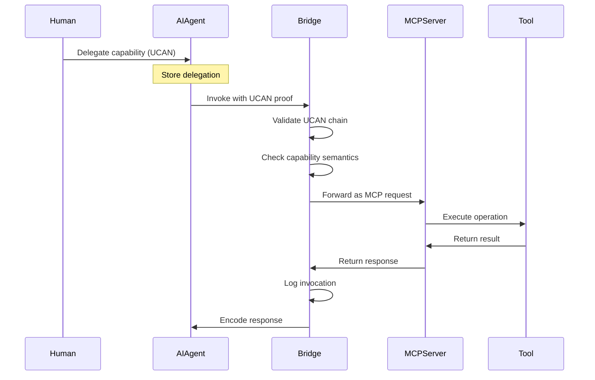

# Augmenting Model Context Protocol with UCAN Capabilities: A ucanto-Inspired Architecture for Safer AI Tool Use

**Version 2.0 | May 2025**

## Abstract

As AI agents gain increasingly sophisticated tool-use capabilities through protocols like Model Context Protocol (MCP), the need for robust authorization and security mechanisms becomes paramount. This paper proposes augmenting MCP with User-Controlled Authorization Network (UCAN) capabilities, drawing inspiration from ucanto's elegant RPC design. By treating capabilities as first-class RPC methods and integrating UCAN's cryptographically-verifiable authorization chains into MCP's JSON-RPC transport, we achieve fine-grained permission control, temporal boundaries, and cryptographic proof chains that significantly reduce the attack surface and potential for misuse in AI systems. The proposed architecture maintains backward compatibility with existing MCP implementations while enabling progressive enhancement through capability-aware routing, batch invocations, and pluggable transport encodings.

## Table of Contents

1. [Introduction](#1-introduction)
2. [Background](#2-background)
3. [Architecture Overview](#3-architecture-overview)
4. [Technical Design](#4-technical-design)
5. [ucanto-Inspired Enhancements](#5-ucanto-inspired-enhancements)
6. [Security Properties](#6-security-properties)
7. [Implementation Examples](#7-implementation-examples)
8. [Transport Layer Integration](#8-transport-layer-integration)
9. [Use Cases](#9-use-cases)
10. [Performance Considerations](#10-performance-considerations)
11. [Migration Strategy](#11-migration-strategy)
12. [Future Work](#12-future-work)
13. [Conclusion](#13-conclusion)

## 1. Introduction

### 1.1 The Growing Challenge of AI Tool Use

Large Language Models (LLMs) and AI agents are increasingly being granted access to external tools and systems to enhance their capabilities. While this integration enables powerful applications, it also introduces significant security risks:

- **Unconstrained Authority**: AI agents often receive broad permissions that exceed their actual needs
- **Lack of Auditability**: Current systems provide limited visibility into the chain of authority
- **No Temporal Boundaries**: Permissions typically persist indefinitely
- **Privilege Escalation**: Compromised or misbehaving agents can abuse their authority
- **Insufficient Isolation**: Limited ability to contain the blast radius of security incidents

### 1.2 The Promise of Capability-Based Security

Capability-based security offers a fundamentally different approach to authorization that aligns perfectly with the needs of AI agent systems:

- **Principle of Least Authority (POLA)**: Agents receive only the minimum permissions needed
- **Unforgeable References**: Cryptographic proofs prevent capability tampering
- **Composability**: Capabilities can be safely combined and delegated
- **Revocability**: Permissions can be instantly revoked without system changes

### 1.3 Learning from ucanto

ucanto, a UCAN-based RPC framework developed by Storacha (formerly web3.storage), demonstrates how capabilities can be elegantly integrated as first-class citizens in an RPC protocol. Key innovations include:

- **Capabilities as Routes**: Each capability maps to an RPC endpoint, similar to REST routes
- **Built-in Validation**: Automatic UCAN validation on invocation
- **Type-Safe Interfaces**: Full type inference between client and server
- **Pluggable Transport**: Support for multiple encodings (CAR, CBOR, JSON)
- **Batch Operations**: Multiple invocations in a single request

### 1.4 Contribution

This paper presents a novel architecture that combines:
- **Model Context Protocol (MCP)**: For flexible AI-tool integration
- **UCAN (User-Controlled Authorization Network)**: For cryptographically-secure, attenuated capabilities
- **ucanto Design Patterns**: For elegant capability-first RPC

The result is a system that maintains MCP's ease of use while adding UCAN's security guarantees through ucanto-inspired design patterns, creating a safer foundation for AI agent deployments.

## 2. Background

### 2.1 Model Context Protocol (MCP)

MCP is an open protocol that enables seamless integration between AI assistants and external data sources or tools. Key features include:

- **Tool Discovery**: Dynamic registration and discovery of available tools
- **Standardized Interface**: Consistent API for tool invocation
- **Context Management**: Efficient handling of conversation context
- **JSON-RPC Transport**: Standards-based message format

However, MCP currently lacks sophisticated authorization mechanisms, typically relying on simple API keys or OAuth tokens that grant broad access.

### 2.2 UCAN (User-Controlled Authorization Network)

UCAN is a trustless, secure, local-first, user-originated authorization scheme based on:

- **Decentralized Identifiers (DIDs)**: Self-sovereign identity without central authorities
- **Capability Chains**: Cryptographically-verifiable delegation chains
- **Attenuation**: Each delegation must have equal or lesser authority
- **Time Bounds**: Built-in expiration and "not-before" timestamps
- **Revocation**: Ability to invalidate capabilities and their descendants

### 2.3 ucanto: UCAN RPC Done Right

ucanto demonstrates how UCAN can be elegantly integrated into RPC systems:

```javascript
// Define a capability
const FileLink = capability({
  can: 'file/link',
  with: URI.match({ protocol: 'file:' }),
  nb: { link: Link },
  derives: (claimed, delegated) =>
    claimed.uri.href.startsWith(delegated.uri.href) ||
    new Failure(`Path ${claimed.uri} not in ${delegated.uri}`)
})

// Bind capability to handler
const service = {
  file: {
    link: provide(FileLink, ({ capability }) => {
      // Handler implementation
      return { with: capability.with, link: capability.nb.link }
    })
  }
}
```

### 2.4 The Synergy

By adopting ucanto's design patterns within MCP's ecosystem, we can:
- Transform MCP tools into capability-aware services
- Add cryptographic authorization to JSON-RPC
- Enable progressive enhancement of existing deployments
- Maintain full backward compatibility

## 3. Architecture Overview

### 3.1 High-Level Design

```
┌─────────────────┐     ┌──────────────────┐     ┌─────────────────┐
│                 │     │                  │     │                 │
│   AI Agent      │────▶│ UCAN-MCP Bridge  │────▶│   MCP Server    │
│                 │     │ (ucanto-style)   │     │                 │
└─────────────────┘     └──────────────────┘     └─────────────────┘
        │                         │                         │
        │                         ▼                         ▼
        │               ┌──────────────────┐     ┌─────────────────┐
        │               │                  │     │                 │
        └──────────────▶│ Capability Store │     │ Tool/Resource   │
                        │ (Content-addressed)│    │                 │
                        └──────────────────┘     └─────────────────┘
```

### 3.2 Core Components

#### 3.2.1 UCAN-MCP Bridge (ucanto-inspired)
The bridge acts as a capability-aware RPC gateway:
- Decodes UCAN invocations from various transport formats
- Validates capability chains using ucanto's validation logic
- Routes invocations to appropriate MCP tools
- Encodes responses in the requested format

#### 3.2.2 Capability-Aware MCP Server
Enhanced MCP servers that understand capabilities:
- Register tools as capability handlers
- Declare required capabilities for each method
- Validate invocation arguments against policies
- Support batch operations

#### 3.2.3 Content-Addressed Capability Store
Following ucanto's approach:
- Store capabilities and delegations as content-addressed blocks
- Support efficient proof resolution
- Enable garbage collection of expired capabilities
- Provide fast lookup by CID

### 3.3 Protocol Flow



## 4. Technical Design

### 4.1 Capability Definition (ucanto-style)

```typescript
import { capability, URI, struct, string } from '@ucanto/validator'

// Define MCP tool capabilities
export const MCPToolInvoke = capability({
  can: 'mcp/tool/invoke',
  with: URI.match({ protocol: 'mcp:' }),
  nb: struct({
    tool: string,
    method: string,
    params: struct({})
  }),
  derives: (claimed, delegated) => {
    // Check if claimed tool matches delegated pattern
    const pattern = new URLPattern(delegated.with)
    return pattern.test(claimed.with) ||
      new Failure(`Tool ${claimed.with} not authorized by ${delegated.with}`)
  }
})

// Specific tool capabilities
export const DatabaseQuery = capability({
  can: 'database/query',
  with: URI.match({ protocol: 'db:' }),
  nb: struct({
    sql: string,
    params: struct({}),
    limit: number.optional()
  }),
  derives: (claimed, delegated) => {
    // Validate SQL is read-only
    const sql = claimed.nb.sql.toLowerCase()
    if (sql.includes('insert') || sql.includes('update') || sql.includes('delete')) {
      return new Failure('Write operations not allowed')
    }
    return ok({})
  }
})
```

### 4.2 Service Definition

```typescript
import { provide } from '@ucanto/server'
import { MCPClient } from '@modelcontextprotocol/sdk'

export const createMCPService = (mcpClient: MCPClient) => ({
  mcp: {
    tool: {
      invoke: provide(MCPToolInvoke, async ({ capability, invocation }) => {
        // Extract tool invocation details
        const { tool, method, params } = capability.nb
        
        // Validate against MCP server's declared capabilities
        const toolInfo = await mcpClient.getTool(tool)
        if (!toolInfo) {
          throw new Error(`Tool ${tool} not found`)
        }
        
        // Execute via MCP
        const result = await mcpClient.invoke({
          tool,
          method,
          arguments: params
        })
        
        return {
          with: capability.with,
          result
        }
      })
    }
  },
  
  database: {
    query: provide(DatabaseQuery, async ({ capability }) => {
      const { sql, params, limit } = capability.nb
      
      // Execute query with constraints
      const results = await executeQuery(sql, params, { limit })
      
      return {
        with: capability.with,
        results,
        rowCount: results.length
      }
    })
  }
})
```

### 4.3 Transport Layer Integration

```typescript
import * as Server from '@ucanto/server'
import * as CAR from '@ucanto/transport/car'
import * as CBOR from '@ucanto/transport/cbor'
import * as JSON from './transports/json-rpc'

// Create server with multiple transport options
export const server = Server.create({
  id: serverDID,
  service: createMCPService(mcpClient),
  
  // Support multiple decoders for different content types
  decoder: {
    'application/vnd.ipld.car': CAR.decoder,
    'application/cbor': CBOR.decoder,
    'application/json-rpc': JSON.decoder
  },
  
  // Support multiple encoders
  encoder: {
    'application/vnd.ipld.car': CAR.encoder,
    'application/cbor': CBOR.encoder,
    'application/json-rpc': JSON.encoder
  },
  
  // Capability validation
  canIssue: (capability, issuer) => {
    // Validate issuer has authority over the resource
    return validateAuthority(capability, issuer)
  },
  
  // Custom policy validation
  validateAuthorization: async (capability, invocation) => {
    // Check rate limits, quotas, etc.
    const usage = await getUsage(invocation.issuer)
    if (usage.requests > capability.nb.rateLimit) {
      throw new Error('Rate limit exceeded')
    }
    return { ok: {} }
  }
})
```

### 4.4 JSON-RPC Transport for MCP Compatibility

```typescript
// Custom JSON-RPC transport that bridges UCAN and MCP
export const JSONRPCTransport = {
  decoder: {
    decode: async ({ headers, body }) => {
      const request = JSON.parse(body)
      
      // Extract UCAN from JSON-RPC request
      if (request.method === 'ucan/invoke') {
        const { capabilities, proofs } = request.params
        return {
          invocations: capabilities.map(cap => ({
            capability: cap,
            proofs: proofs
          }))
        }
      }
      
      // Legacy MCP request - wrap in temporary UCAN
      return {
        invocations: [{
          capability: {
            can: 'mcp/tool/invoke',
            with: 'mcp:*',
            nb: {
              tool: request.method.split('/')[0],
              method: request.method.split('/')[1],
              params: request.params
            }
          },
          proofs: [] // Use API key validation
        }]
      }
    }
  },
  
  encoder: {
    encode: async (results) => {
      // Encode as JSON-RPC response
      const responses = results.map((result, index) => ({
        jsonrpc: '2.0',
        id: index,
        result: result.ok ? result.ok : undefined,
        error: result.error ? {
          code: -32000,
          message: result.error.message,
          data: result.error
        } : undefined
      }))
      
      return {
        headers: { 'content-type': 'application/json-rpc' },
        body: JSON.stringify(responses.length === 1 ? responses[0] : responses)
      }
    }
  }
}
```

## 5. ucanto-Inspired Enhancements

### 5.1 Capability-First Tool Definition

Instead of defining tools and adding auth later, define capabilities first:

```typescript
// Traditional MCP tool
const fileSystemTool = {
  name: 'filesystem',
  methods: {
    read: { params: { path: 'string' } },
    write: { params: { path: 'string', content: 'string' } }
  }
}

// Capability-first approach
const FileRead = capability({
  can: 'file/read',
  with: URI.match({ protocol: 'file:' }),
  nb: struct({
    encoding: string.optional()
  })
})

const FileWrite = capability({
  can: 'file/write',
  with: URI.match({ protocol: 'file:' }),
  nb: struct({
    content: string,
    encoding: string.optional()
  })
})
```

### 5.2 Batch Invocations

Support multiple operations in a single request:

```typescript
const client = Client.connect({
  encoder: CAR,
  decoder: CBOR,
  channel: mcpBridge
})

// Execute multiple operations atomically
const [readResult, queryResult] = await client.execute([
  Client.invoke({
    issuer: agent,
    audience: server,
    capability: {
      can: 'file/read',
      with: 'file:///data/config.json'
    },
    proofs: [delegation]
  }),
  Client.invoke({
    issuer: agent,
    audience: server,
    capability: {
      can: 'database/query',
      with: 'db://analytics',
      nb: { sql: 'SELECT * FROM metrics LIMIT 10' }
    },
    proofs: [delegation]
  })
])
```

### 5.3 Type-Safe Client Interface

```typescript
// Service type is inferred from capability definitions
type MCPService = InferService<typeof capabilities>

// Client gets full type inference
const client = Client.connect<MCPService>({
  channel: mcpBridge
})

// TypeScript knows the exact shape of results
const result = await client.file.read({
  with: 'file:///data/test.txt'
})
// result is typed as { with: string, content: string }
```

### 5.4 Progressive Enhancement

Existing MCP servers can be progressively enhanced:

```typescript
// Wrap existing MCP server
export const enhanceMCPServer = (mcpServer: MCPServer) => {
  return new Proxy(mcpServer, {
    get(target, prop) {
      // Intercept method calls
      if (typeof target[prop] === 'function') {
        return async (...args) => {
          // Check for UCAN in context
          const context = args[args.length - 1]
          if (context?.capability) {
            // Validate capability before proceeding
            await validateCapability(context.capability)
          }
          
          // Call original method
          return target[prop](...args)
        }
      }
      return target[prop]
    }
  })
}
```

## 6. Security Properties

### 6.1 Principle of Least Authority (POLA)

The system enforces POLA through:
- **Mandatory Attenuation**: Each delegation must reduce or maintain authority
- **Fine-grained Policies**: Specific constraints on tool usage
- **Temporal Scoping**: Short-lived capabilities by default
- **Resource Patterns**: URI-based resource matching

### 6.2 Cryptographic Security

- **Unforgeable Capabilities**: Based on DID cryptography
- **Content-addressed Proofs**: Immutable reference to delegations
- **Signature Verification**: Every invocation is cryptographically signed
- **Chain Validation**: Complete verification from root to invocation

### 6.3 Auditability

Complete audit trail including:
- **Delegation History**: Full chain from root to invocation
- **Invocation Logs**: Every tool use with full context
- **Policy Decisions**: Why requests were allowed or denied
- **Content-addressed Storage**: Immutable audit records

### 6.4 Composability

Following ucanto's design:
- **Service Composition**: Combine multiple services seamlessly
- **Capability Composition**: Build complex permissions from simple ones
- **Transport Agnostic**: Works across different protocols
- **Type Safety**: Full inference across service boundaries

## 7. Implementation Examples

### 7.1 AI Agent with Limited Database Access

```typescript
// Define specific database capabilities
const AnalyticsRead = capability({
  can: 'db/read',
  with: URI.match({ protocol: 'db:', pathname: '/analytics/*' }),
  nb: struct({
    tables: [string],
    columns: [string].optional(),
    limit: number.default(1000)
  })
})

// Human delegates to AI system
const systemDelegation = await delegate({
  issuer: humanSigner,
  audience: aiSystemDID,
  capabilities: [{
    can: 'db/read',
    with: 'db://analytics/*',
    nb: {
      tables: ['metrics', 'events'],
      limit: 10000
    }
  }],
  expiration: Date.now() + 86400000 // 24 hours
})

// AI system creates limited delegation for specific agent
const agentDelegation = await delegate({
  issuer: aiSystemSigner,
  audience: agentDID,
  capabilities: [{
    can: 'db/read',
    with: 'db://analytics/metrics',
    nb: {
      tables: ['metrics'],
      columns: ['timestamp', 'value', 'type'],
      limit: 100
    }
  }],
  proofs: [systemDelegation],
  expiration: Date.now() + 3600000 // 1 hour
})

// Agent invokes capability
const result = await connection.execute(
  invoke({
    issuer: agentSigner,
    audience: serverDID,
    capability: {
      can: 'db/read',
      with: 'db://analytics/metrics',
      nb: {
        sql: 'SELECT timestamp, value FROM metrics WHERE type = ?',
        params: ['temperature'],
        limit: 50
      }
    },
    proofs: [agentDelegation]
  })
)
```

### 7.2 Multi-Tool Research Workflow

```typescript
// Compose capabilities for research task
const ResearchCapabilities = {
  search: capability({
    can: 'web/search',
    with: URI.match({ protocol: 'https:' }),
    nb: struct({
      query: string,
      limit: number.default(10),
      domains: [string].optional()
    })
  }),
  
  extract: capability({
    can: 'web/extract',
    with: URI.match({ protocol: 'https:' }),
    nb: struct({
      selectors: [string],
      format: string.enum(['text', 'markdown', 'json'])
    })
  }),
  
  summarize: capability({
    can: 'ai/summarize',
    with: URI.match({ protocol: 'text:' }),
    nb: struct({
      maxLength: number.default(500),
      style: string.enum(['bullet', 'paragraph', 'academic'])
    })
  })
}

// Service implementation
const researchService = {
  web: {
    search: provide(ResearchCapabilities.search, async ({ capability }) => {
      const { query, limit, domains } = capability.nb
      const results = await searchEngine.search(query, { limit, domains })
      return { results }
    }),
    
    extract: provide(ResearchCapabilities.extract, async ({ capability }) => {
      const { selectors, format } = capability.nb
      const content = await scraper.extract(capability.with, selectors)
      return formatter.format(content, format)
    })
  },
  
  ai: {
    summarize: provide(ResearchCapabilities.summarize, async ({ capability }) => {
      const { maxLength, style } = capability.nb
      const text = await fetchText(capability.with)
      return llm.summarize(text, { maxLength, style })
    })
  }
}

// Client usage with batch operations
const researchClient = Client.connect({
  encoder: CAR,
  decoder: CBOR,
  channel: HTTP.open({ url: RESEARCH_SERVICE_URL })
})

// Execute research workflow
const doResearch = async (topic: string) => {
  // Phase 1: Search
  const [searchResult] = await researchClient.execute([
    invoke({
      capability: {
        can: 'web/search',
        with: 'https://*',
        nb: { query: topic, limit: 5 }
      }
    })
  ])
  
  // Phase 2: Extract content from top results (batch)
  const extractInvocations = searchResult.results.map(result =>
    invoke({
      capability: {
        can: 'web/extract',
        with: result.url,
        nb: {
          selectors: ['article', 'main', '.content'],
          format: 'markdown'
        }
      }
    })
  )
  
  const extractResults = await researchClient.execute(extractInvocations)
  
  // Phase 3: Summarize all content
  const summaryResult = await researchClient.execute([
    invoke({
      capability: {
        can: 'ai/summarize',
        with: `text:${hashContent(extractResults)}`,
        nb: {
          maxLength: 1000,
          style: 'academic'
        }
      }
    })
  ])
  
  return {
    sources: searchResult.results,
    content: extractResults,
    summary: summaryResult[0]
  }
}
```

### 7.3 Secure File Management

```typescript
// Define granular file capabilities
const FileCapabilities = {
  list: capability({
    can: 'fs/list',
    with: URI.match({ protocol: 'file:' }),
    nb: struct({
      recursive: boolean.default(false),
      pattern: string.optional()
    })
  }),
  
  read: capability({
    can: 'fs/read',
    with: URI.match({ protocol: 'file:' }),
    nb: struct({
      encoding: string.default('utf8'),
      range: struct({
        start: number,
        end: number
      }).optional()
    })
  }),
  
  write: capability({
    can: 'fs/write',
    with: URI.match({ protocol: 'file:' }),
    nb: struct({
      content: string,
      encoding: string.default('utf8'),
      mode: string.enum(['overwrite', 'append']).default('overwrite')
    })
  })
}

// Implement with security checks
const fileService = {
  fs: {
    list: provide(FileCapabilities.list, async ({ capability }) => {
      const { recursive, pattern } = capability.nb
      const path = new URL(capability.with).pathname
      
      // Security: Validate path is within allowed directory
      if (!path.startsWith('/allowed/')) {
        throw new Error('Access denied: Path outside allowed directory')
      }
      
      const files = await fs.list(path, { recursive, pattern })
      return { files }
    }),
    
    read: provide(FileCapabilities.read, async ({ capability, invocation }) => {
      const path = new URL(capability.with).pathname
      const { encoding, range } = capability.nb
      
      // Track usage for rate limiting
      await trackUsage(invocation.issuer, 'read', path)
      
      const content = await fs.read(path, { encoding, range })
      return { content, size: content.length }
    }),
    
    write: provide(FileCapabilities.write, async ({ capability, invocation }) => {
      const path = new URL(capability.with).pathname
      const { content, encoding, mode } = capability.nb
      
      // Additional validation for write operations
      if (content.length > MAX_FILE_SIZE) {
        throw new Error('File too large')
      }
      
      // Create audit log entry
      await auditLog.record({
        action: 'fs/write',
        actor: invocation.issuer,
        resource: capability.with,
        timestamp: Date.now()
      })
      
      await fs.write(path, content, { encoding, mode })
      return { written: content.length }
    })
  }
}
```

## 8. Transport Layer Integration

### 8.1 MCP-Compatible JSON-RPC Transport

```typescript
// Extend MCP's JSON-RPC with UCAN support
class UCANJSONRPCTransport implements Transport {
  async decode(request: HTTPRequest): Promise<Invocation[]> {
    const body = await request.json()
    
    // Handle both UCAN and legacy MCP requests
    if (body.method === 'ucan/invoke') {
      // Native UCAN invocation
      return this.decodeUCAN(body.params)
    } else if (body.method?.startsWith('tools/')) {
      // Legacy MCP request - wrap in UCAN
      return this.wrapMCPRequest(body)
    }
    
    throw new Error('Unknown request format')
  }
  
  private async decodeUCAN(params: any): Promise<Invocation[]> {
    const { invocations, proofs } = params
    
    // Resolve proofs from CIDs if needed
    const resolvedProofs = await Promise.all(
      proofs.map(p => typeof p === 'string' ? this.resolveProof(p) : p)
    )
    
    return invocations.map(inv => ({
      ...inv,
      proofs: resolvedProofs
    }))
  }
  
  private wrapMCPRequest(request: any): Invocation[] {
    // Extract tool and method from MCP format
    const [_, tool, method] = request.method.match(/tools\/([^\/]+)\/(.+)/)
    
    return [{
      capability: {
        can: 'mcp/tool/invoke',
        with: `mcp://${tool}`,
        nb: {
          method,
          params: request.params
        }
      },
      proofs: [] // Will use API key validation
    }]
  }
  
  async encode(results: Result[]): Promise<HTTPResponse> {
    const responses = results.map((result, i) => ({
      jsonrpc: '2.0',
      id: i + 1,
      result: result.ok || undefined,
      error: result.error ? {
        code: -32000,
        message: result.error.message
      } : undefined
    }))
    
    return new Response(
      JSON.stringify(responses.length === 1 ? responses[0] : responses),
      { headers: { 'content-type': 'application/json-rpc' } }
    )
  }
}
```

### 8.2 Content-Addressed Storage Integration

```typescript
// Store and retrieve UCAN proofs efficiently
class ContentAddressedProofStore {
  private ipfs: IPFSClient
  private cache: LRUCache<string, Delegation>
  
  async store(delegation: Delegation): Promise<CID> {
    // Encode as DAG-CBOR block
    const block = await Block.encode({
      value: delegation,
      codec: dagCBOR,
      hasher: sha256
    })
    
    // Store in IPFS
    await this.ipfs.block.put(block.bytes, { cid: block.cid })
    
    // Cache for fast retrieval
    this.cache.set(block.cid.toString(), delegation)
    
    return block.cid
  }
  
  async retrieve(cid: CID): Promise<Delegation> {
    // Check cache first
    const cached = this.cache.get(cid.toString())
    if (cached) return cached
    
    // Retrieve from IPFS
    const bytes = await this.ipfs.block.get(cid)
    const block = await Block.decode({
      bytes,
      codec: dagCBOR,
      hasher: sha256
    })
    
    // Validate and cache
    const delegation = Delegation.parse(block.value)
    this.cache.set(cid.toString(), delegation)
    
    return delegation
  }
  
  async resolveChain(leaf: CID): Promise<Delegation[]> {
    const chain: Delegation[] = []
    let current = await this.retrieve(leaf)
    
    while (current) {
      chain.push(current)
      
      // Follow proof chain
      if (current.proofs.length > 0) {
        current = await this.retrieve(current.proofs[0])
      } else {
        break
      }
    }
    
    return chain.reverse() // Root first
  }
}
```

### 8.3 Streaming Support

```typescript
// Support streaming responses for large operations
const StreamingCapabilities = {
  stream: capability({
    can: 'data/stream',
    with: URI.match({ protocol: 'stream:' }),
    nb: struct({
      format: string.enum(['json', 'cbor', 'car']),
      chunks: number.optional()
    })
  })
}

const streamingService = {
  data: {
    stream: provide(StreamingCapabilities.stream, 
      async function* ({ capability }) {
        const { format, chunks = Infinity } = capability.nb
        const source = new URL(capability.with).pathname
        
        let count = 0
        for await (const chunk of dataSource.stream(source)) {
          if (count >= chunks) break
          
          yield encode(chunk, format)
          count++
        }
      }
    )
  }
}
```

## 9. Use Cases

### 9.1 Enterprise AI Assistants

**Scenario**: Corporate AI assistants need controlled access to internal resources.

**Solution**:
```typescript
// IT creates root capabilities for systems
const systemCapabilities = await delegate({
  issuer: itAdminSigner,
  audience: aiPlatformDID,
  capabilities: [
    { can: 'crm/read', with: 'crm://*' },
    { can: 'email/send', with: 'mailto:*@company.com' },
    { can: 'calendar/read', with: 'cal://*' }
  ],
  expiration: null // Permanent for platform
})

// Managers create time-bound delegations
const assistantCapabilities = await delegate({
  issuer: aiPlatformSigner,
  audience: assistantDID,
  capabilities: [
    { 
      can: 'crm/read', 
      with: 'crm://sales/*',
      nb: { fields: ['name', 'email', 'company'] }
    },
    {
      can: 'email/send',
      with: 'mailto:*@company.com',
      nb: { maxRecipients: 10, maxSizeKB: 1024 }
    }
  ],
  proofs: [systemCapabilities],
  expiration: Date.now() + 604800000 // 1 week
})
```

### 9.2 Collaborative AI Research Platform

**Scenario**: Multiple AI agents collaborating on research with different specializations.

**Solution**:
```typescript
// Define research platform capabilities
const ResearchPlatform = {
  orchestrator: aiOrchestatorDID,
  
  agents: {
    searcher: { did: searchAgentDID, speciality: 'web/search' },
    analyzer: { did: analyzerAgentDID, speciality: 'data/analyze' },
    writer: { did: writerAgentDID, speciality: 'doc/write' }
  },
  
  async delegateForProject(projectId: string, duration: number) {
    // Orchestrator gets broad capabilities
    const orchestratorCaps = await delegate({
      issuer: platformSigner,
      audience: this.orchestrator,
      capabilities: [
        { can: '*', with: `project://${projectId}/*` }
      ],
      expiration: Date.now() + duration
    })
    
    // Each specialist gets limited capabilities
    const searcherCaps = await delegate({
      issuer: orchestratorSigner,
      audience: this.agents.searcher.did,
      capabilities: [
        { 
          can: 'web/search',
          with: 'https://*',
          nb: { maxResults: 100, maxQueries: 50 }
        },
        {
          can: 'project/write',
          with: `project://${projectId}/sources`
        }
      ],
      proofs: [orchestratorCaps],
      expiration: Date.now() + duration
    })
    
    // Continue for other agents...
    return { orchestratorCaps, searcherCaps, /* ... */ }
  }
}
```

### 9.3 Secure Customer Service AI

**Scenario**: AI handling sensitive customer data with strict compliance requirements.

**Solution**:
```typescript
// Per-conversation capabilities with audit trail
class CustomerServiceCapabilities {
  async createConversationScope(
    customerId: string,
    agentId: string,
    allowedData: string[]
  ) {
    // Create conversation-specific capability
    const capability = await delegate({
      issuer: servicePlatformSigner,
      audience: agentId,
      capabilities: [
        {
          can: 'customer/read',
          with: `customer://${customerId}`,
          nb: {
            fields: allowedData,
            purpose: 'support',
            retentionHours: 24
          }
        },
        {
          can: 'ticket/create',
          with: `ticket://${customerId}/*`,
          nb: { maxTickets: 3 }
        }
      ],
      expiration: Date.now() + 3600000, // 1 hour
      facts: {
        sessionId: crypto.randomUUID(),
        timestamp: new Date().toISOString(),
        complianceMode: 'gdpr'
      }
    })
    
    // Log for compliance
    await auditLog.record({
      action: 'capability.issue',
      subject: customerId,
      agent: agentId,
      capability: capability.cid,
      allowedData
    })
    
    return capability
  }
}
```

## 10. Performance Considerations

### 10.1 Computational Overhead

Based on ucanto's production usage:
- **Signature Verification**: ~0.5-1ms per Ed25519 signature
- **Capability Parsing**: ~0.1ms per capability
- **Chain Validation**: O(n) where n is chain length, typically < 5ms
- **Transport Encoding**: CAR/CBOR adds ~2-5% overhead vs raw JSON

### 10.2 Optimization Strategies

```typescript
// Capability validation cache
class ValidationCache {
  private validated = new LRUCache<string, boolean>({ max: 10000 })
  private validatedAt = new Map<string, number>()
  
  async validateWithCache(invocation: Invocation): Promise<boolean> {
    const key = await invocation.cid()
    
    // Check cache (with 5-minute TTL)
    const cached = this.validated.get(key)
    const cachedAt = this.validatedAt.get(key) || 0
    
    if (cached !== undefined && Date.now() - cachedAt < 300000) {
      return cached
    }
    
    // Validate and cache
    const valid = await validate(invocation)
    this.validated.set(key, valid)
    this.validatedAt.set(key, Date.now())
    
    return valid
  }
}

// Batch validation for multiple invocations
async function validateBatch(invocations: Invocation[]): Promise<boolean[]> {
  // Group by issuer for signature batch verification
  const grouped = groupBy(invocations, inv => inv.issuer)
  
  const results = await Promise.all(
    Object.entries(grouped).map(async ([issuer, group]) => {
      // Batch verify signatures from same issuer
      const signatures = group.map(inv => inv.signature)
      const messages = group.map(inv => inv.payload)
      
      const valid = await batchVerify(issuer, signatures, messages)
      return group.map((inv, i) => ({ inv, valid: valid[i] }))
    })
  )
  
  // Flatten and sort back to original order
  return results.flat().sort((a, b) => 
    invocations.indexOf(a.inv) - invocations.indexOf(b.inv)
  ).map(r => r.valid)
}
```

### 10.3 Storage Efficiency

```typescript
// Efficient proof storage with deduplication
class ProofStore {
  private blocks = new Map<string, Uint8Array>()
  private refCount = new Map<string, number>()
  
  async storeProofChain(chain: Delegation[]): Promise<CID[]> {
    const cids: CID[] = []
    
    for (const delegation of chain) {
      // Encode delegation
      const block = await encode(delegation)
      const cid = block.cid.toString()
      
      // Deduplicate storage
      if (this.blocks.has(cid)) {
        this.refCount.set(cid, (this.refCount.get(cid) || 0) + 1)
      } else {
        this.blocks.set(cid, block.bytes)
        this.refCount.set(cid, 1)
      }
      
      cids.push(block.cid)
    }
    
    return cids
  }
  
  async pruneExpired(): Promise<number> {
    let pruned = 0
    
    for (const [cid, bytes] of this.blocks.entries()) {
      const delegation = await decode(bytes)
      
      // Check if expired
      if (delegation.expiration && delegation.expiration < Date.now()) {
        const refs = this.refCount.get(cid) || 0
        
        if (refs <= 1) {
          this.blocks.delete(cid)
          this.refCount.delete(cid)
          pruned++
        } else {
          this.refCount.set(cid, refs - 1)
        }
      }
    }
    
    return pruned
  }
}
```

## 11. Migration Strategy

### 11.1 Phase 1: Compatibility Bridge (Weeks 1-4)

```typescript
// Wrap existing MCP servers with UCAN validation
class MCPUCANBridge {
  constructor(
    private mcpServer: MCPServer,
    private config: BridgeConfig
  ) {}
  
  async handleRequest(request: Request): Promise<Response> {
    // Try UCAN parsing first
    try {
      const invocation = await this.parseUCANRequest(request)
      const result = await this.executeWithCapability(invocation)
      return this.encodeUCANResponse(result)
    } catch (e) {
      // Fall back to legacy MCP with API key
      if (this.config.allowLegacy) {
        return this.handleLegacyMCP(request)
      }
      throw e
    }
  }
  
  private async handleLegacyMCP(request: Request): Promise<Response> {
    // Validate API key
    const apiKey = request.headers.get('authorization')
    const permissions = await this.validateAPIKey(apiKey)
    
    // Create temporary UCAN for this request
    const tempCapability = await this.createTempCapability(
      permissions,
      request
    )
    
    // Execute with temporary capability
    return this.executeWithCapability(tempCapability)
  }
}
```

### 11.2 Phase 2: Native Tool Integration (Weeks 5-12)

```typescript
// Enhance MCP tools with native capability support
class CapabilityAwareMCPTool {
  capabilities = {
    read: capability({
      can: `${this.name}/read`,
      with: URI.match({ protocol: this.protocol }),
      nb: this.readSchema
    }),
    
    write: capability({
      can: `${this.name}/write`,
      with: URI.match({ protocol: this.protocol }),
      nb: this.writeSchema
    })
  }
  
  async registerWithMCP(server: MCPServer) {
    // Register traditional MCP endpoints
    server.addTool(this.name, {
      read: this.handleRead.bind(this),
      write: this.handleWrite.bind(this)
    })
    
    // Also register as capability service
    server.addCapabilityService({
      [this.name]: {
        read: provide(this.capabilities.read, this.handleRead.bind(this)),
        write: provide(this.capabilities.write, this.handleWrite.bind(this))
      }
    })
  }
}
```

### 11.3 Phase 3: Full UCAN-First Architecture (Weeks 13+)

```typescript
// New tools are capability-first
export const createModernMCPServer = () => {
  const capabilities = defineCapabilities({
    'fs/*': FileSystemCapabilities,
    'db/*': DatabaseCapabilities,
    'ai/*': AICapabilities,
    'mcp/*': MCPCompatCapabilities
  })
  
  return Server.create({
    id: serverDID,
    service: createServiceFromCapabilities(capabilities),
    
    // Multi-transport support
    transports: {
      http: HTTPTransport,
      websocket: WebSocketTransport,
      stdio: StdioTransport
    },
    
    // Built-in middleware
    middleware: [
      rateLimitMiddleware(),
      auditMiddleware(),
      cacheMiddleware()
    ],
    
    // Capability-aware routing
    router: new CapabilityRouter(capabilities)
  })
}
```

## 12. Future Work

### 12.1 Advanced Policy Languages

Explore Datalog-based policies like Biscuit:
```datalog
// Define complex policies in Datalog
allow(Operation) :-
  operation(Operation),
  resource(Operation, Resource),
  principal(Operation, Principal),
  has_capability(Principal, Resource, read),
  working_hours(),
  under_rate_limit(Principal).

working_hours() :-
  current_time(Hour),
  Hour >= 9,
  Hour < 17.
```

### 12.2 Decentralized Capability Registry

```typescript
// IPNS-based capability discovery
interface CapabilityRegistry {
  // Publish service capabilities
  async publish(service: ServiceCapabilities): Promise<IPNSName>
  
  // Discover capabilities by DID
  async discover(did: DID): Promise<ServiceCapabilities[]>
  
  // Subscribe to capability updates
  subscribe(did: DID, callback: (caps: ServiceCapabilities) => void): () => void
}
```

### 12.3 AI-Aware Capability Generation

```typescript
// LLM generates appropriate capability requests
class AICapabilityAssistant {
  async suggestCapabilities(
    task: string,
    context: Context
  ): Promise<CapabilityRequest[]> {
    const analysis = await this.llm.analyze({
      task,
      availableTools: context.tools,
      securityPolicy: context.policy
    })
    
    return analysis.requiredCapabilities.map(cap => ({
      can: cap.action,
      with: cap.resource,
      nb: cap.constraints,
      duration: cap.estimatedDuration
    }))
  }
}
```

## 13. Conclusion

By augmenting the Model Context Protocol with UCAN capabilities following ucanto's elegant design patterns, we achieve a powerful synthesis that addresses the critical security challenges of AI tool use while maintaining developer ergonomics and system flexibility.

Key achievements of this architecture:

1. **Security by Design**: Capabilities are not an afterthought but the primary interface
2. **Progressive Enhancement**: Existing MCP deployments can adopt incrementally  
3. **Developer Experience**: Type-safe, composable APIs inspired by ucanto
4. **Production Ready**: Based on battle-tested concepts from ucanto's deployment at scale
5. **Future Proof**: Extensible to new transport protocols and policy languages

The ucanto-inspired approach of treating capabilities as first-class RPC methods transforms the security model from a burden to an enabler. Instead of adding authentication and authorization as separate concerns, they become integral to the API design itself.

As AI agents become more autonomous and powerful, this capability-first architecture provides the foundation needed for safe, auditable, and controlled tool use. By learning from ucanto's production experience and combining it with MCP's ecosystem, we can build AI systems that are both powerful and trustworthy.

The future of AI tool integration lies not in choosing between security and functionality, but in architectures that provide both through elegant, capability-based design.

## References

1. User-Controlled Authorization Network (UCAN) Specification v0.10.0. UCAN Working Group. https://github.com/ucan-wg/spec

2. ucanto - UCAN RPC Framework. Storacha. https://github.com/storacha/ucanto

3. Model Context Protocol Specification. Anthropic. https://modelcontextprotocol.io

4. Miller, M. S. (2006). Robust Composition: Towards a Unified Approach to Access Control and Concurrency Control. PhD thesis, Johns Hopkins University.

5. UCAN Invocation Specification. UCAN Working Group. https://github.com/ucan-wg/invocation

6. Lemmer-Webber, C., et al. (2019). Object Capability Security in Distributed Systems. OCAP Working Group.

7. Content-addressed, authenticated data structures. IPLD. https://ipld.io

8. JSON-RPC 2.0 Specification. https://www.jsonrpc.org/specification

9. Capability-based RPC Protocol Design. Storacha Blog. https://blog.storacha.network/

10. Principle of Least Authority in Distributed Systems. Karp, A. H., et al. HP Labs.